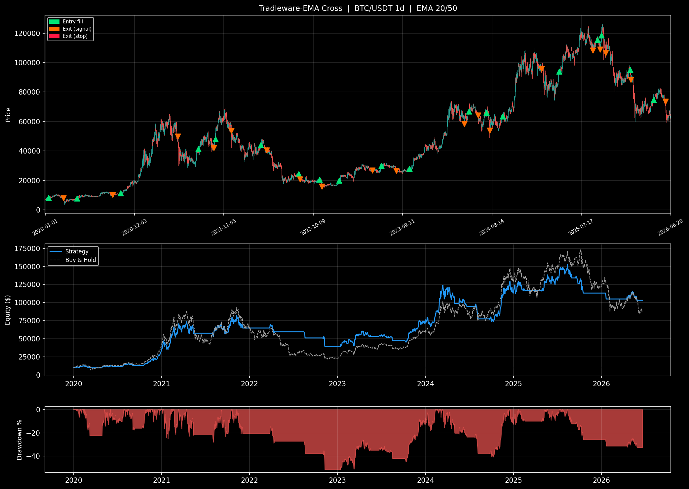

# Tradleware-EMA Cross  |  BTC/USDT 1d  |  EMA 20/50

*Run: 2026-06-20*

| Metric | Value | Note |
|:---|---:|:---|
| Total return | +931.6% | compare to buy-and-hold over the same period |
| CAGR | +43.5% | > 15% solid, > 30% strong |
| Sharpe | 1.05 | > 1 decent, > 2 strong, > 3 suspicious |
| Sortino | 1.18 | like Sharpe but penalises downside vol only |
| Max drawdown | -39.0% | on closed-trade equity; lower is better; > 50% is brutal |
| Calmar | 1.12 | CAGR / max DD; > 0.5 decent, > 1 good |
| Win rate | 42.1% | 30–45% normal for trend, 60–75% for mean-rev |
| Profit factor | 2.11 | > 1.5 decent, > 2 good |
| Avg win | +74.4% | compare to avg loss below |
| Avg loss | -9.6% | keep smaller than avg win |
| R-multiple | 7.75 | avg win / avg loss; > 1.5 sustains a low win rate |
| Trades | 19 | < 30 = stats unreliable; aim for 100+ |
| Exposure | 57.9% | % of bars in market; higher = more capital utilised |

## Trades (19 total)

| # | Entry date | Entry $ | Exit date | Exit $ | PnL% | W/L | Reason |
|--:|:----------|-------:|:---------|------:|-----:|:---:|:-------|
| 1 | 2020-01-13 | 8,185.00 | 2020-03-09 | 8,034.73 | -1.84% | L | signal |
| 2 | 2020-04-29 | 7,738.61 | 2020-09-11 | 10,336.83 | +33.57% | W | signal |
| 3 | 2020-10-11 | 11,293.25 | 2021-05-15 | 49,844.13 | +341.36% | W | signal |
| 4 | 2021-08-01 | 41,461.87 | 2021-09-28 | 42,147.32 | +1.65% | W | signal |
| 5 | 2021-10-04 | 48,200.04 | 2021-12-04 | 53,601.02 | +11.21% | W | signal |
| 6 | 2022-03-25 | 43,991.49 | 2022-04-16 | 40,551.87 | -7.82% | L | signal |
| 7 | 2022-08-15 | 24,305.28 | 2022-08-20 | 20,834.36 | -14.28% | L | signal |
| 8 | 2022-11-02 | 20,482.84 | 2022-11-10 | 15,922.65 | -22.26% | L | signal |
| 9 | 2023-01-14 | 19,930.04 | 2023-05-20 | 26,880.23 | +34.87% | W | signal |
| 10 | 2023-06-23 | 29,884.95 | 2023-08-18 | 26,623.38 | -10.91% | L | signal |
| 11 | 2023-10-07 | 27,931.13 | 2024-05-02 | 58,364.94 | +108.96% | W | signal |
| 12 | 2024-05-19 | 66,915.23 | 2024-06-23 | 64,261.98 | -3.97% | L | signal |
| 13 | 2024-07-24 | 65,936.03 | 2024-08-06 | 54,018.79 | -18.07% | L | signal |
| 14 | 2024-09-23 | 63,578.79 | 2025-02-18 | 95,779.98 | +50.65% | W | signal |
| 15 | 2025-04-25 | 93,980.50 | 2025-08-30 | 108,377.37 | +15.32% | W | signal |
| 16 | 2025-09-16 | 115,349.74 | 2025-09-26 | 108,994.46 | -5.51% | L | signal |
| 17 | 2025-10-02 | 118,595.02 | 2025-10-18 | 106,431.65 | -10.26% | L | signal |
| 18 | 2026-01-18 | 95,147.80 | 2026-01-21 | 88,427.63 | -7.06% | L | signal |
| 19 | 2026-04-16 | 74,810.02 | 2026-06-01 | 73,674.36 | -1.52% | L | signal |

