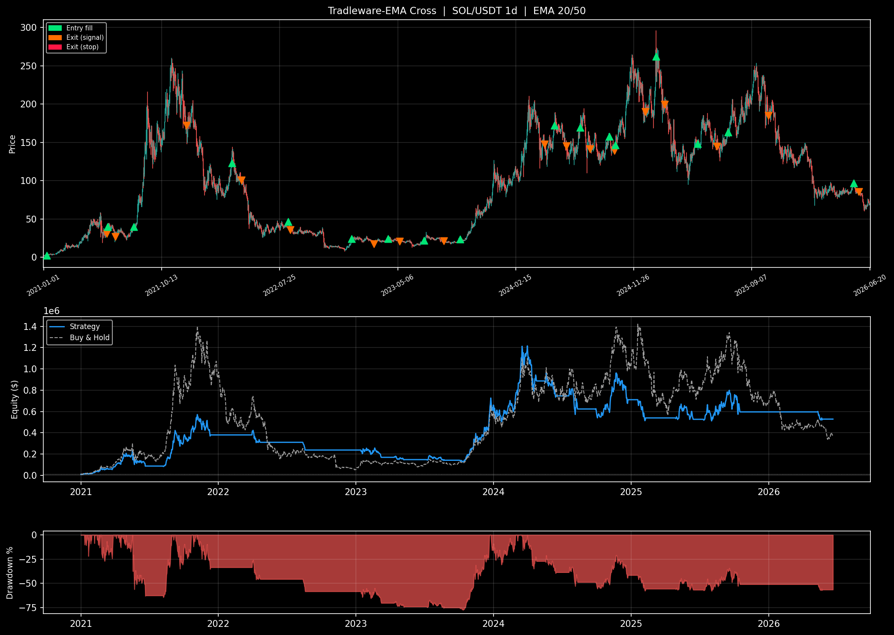

# Tradleware-EMA Cross  |  SOL/USDT 1d  |  EMA 20/50

*Run: 2026-06-20*

| Metric | Value | Note |
|:---|---:|:---|
| Total return | +5184.2% | compare to buy-and-hold over the same period |
| CAGR | +106.7% | > 15% solid, > 30% strong |
| Sharpe | 1.28 | > 1 decent, > 2 strong, > 3 suspicious |
| Sortino | 1.55 | like Sharpe but penalises downside vol only |
| Max drawdown | -62.6% | on closed-trade equity; lower is better; > 50% is brutal |
| Calmar | 1.70 | CAGR / max DD; > 0.5 decent, > 1 good |
| Win rate | 29.4% | 30–45% normal for trend, 60–75% for mean-rev |
| Profit factor | 1.60 | > 1.5 decent, > 2 good |
| Avg win | +418.1% | compare to avg loss below |
| Avg loss | -16.8% | keep smaller than avg win |
| R-multiple | 24.90 | avg win / avg loss; > 1.5 sustains a low win rate |
| Trades | 17 | < 30 = stats unreliable; aim for 100+ |
| Exposure | 49.3% | % of bars in market; higher = more capital utilised |

## Trades (17 total)

| # | Entry date | Entry $ | Exit date | Exit $ | PnL% | W/L | Reason |
|--:|:----------|-------:|:---------|------:|-----:|:---:|:-------|
| 1 | 2021-01-08 | 2.40 | 2021-06-02 | 30.90 | +1189.96% | W | signal |
| 2 | 2021-06-04 | 39.63 | 2021-06-23 | 26.93 | -32.05% | L | signal |
| 3 | 2021-08-07 | 39.53 | 2021-12-12 | 172.12 | +335.39% | W | signal |
| 4 | 2022-04-01 | 122.82 | 2022-04-24 | 100.60 | -18.09% | L | signal |
| 5 | 2022-08-14 | 46.62 | 2022-08-20 | 35.79 | -23.23% | L | signal |
| 6 | 2023-01-15 | 24.26 | 2023-03-10 | 17.31 | -28.65% | L | signal |
| 7 | 2023-04-13 | 23.84 | 2023-05-11 | 20.89 | -12.37% | L | signal |
| 8 | 2023-07-09 | 21.85 | 2023-08-25 | 21.02 | -3.80% | L | signal |
| 9 | 2023-10-04 | 23.64 | 2024-04-25 | 147.76 | +525.04% | W | signal |
| 10 | 2024-05-19 | 172.43 | 2024-06-16 | 145.49 | -15.62% | L | signal |
| 11 | 2024-07-20 | 169.15 | 2024-08-12 | 141.53 | -16.33% | L | signal |
| 12 | 2024-09-28 | 157.66 | 2024-10-11 | 139.01 | -11.83% | L | signal |
| 13 | 2024-10-13 | 146.42 | 2024-12-24 | 190.09 | +29.83% | W | signal |
| 14 | 2025-01-19 | 262.00 | 2025-02-09 | 199.29 | -23.94% | L | signal |
| 15 | 2025-04-29 | 147.87 | 2025-06-15 | 144.62 | -2.20% | L | signal |
| 16 | 2025-07-12 | 162.95 | 2025-10-17 | 184.81 | +13.42% | W | signal |
| 17 | 2026-05-11 | 96.49 | 2026-05-24 | 85.73 | -11.15% | L | signal |

